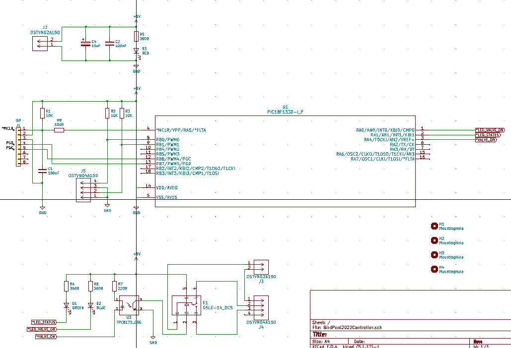
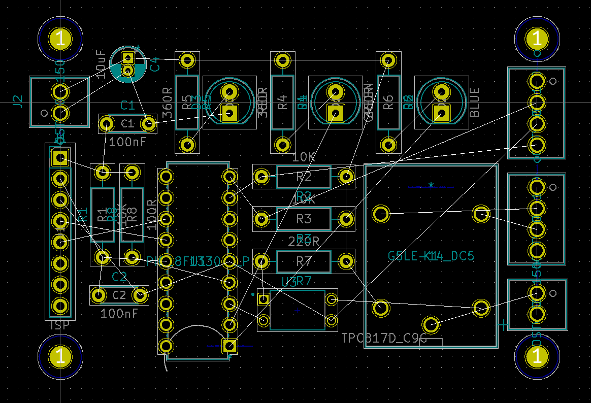
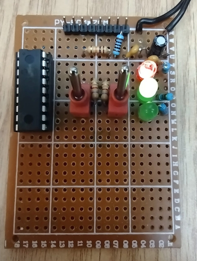
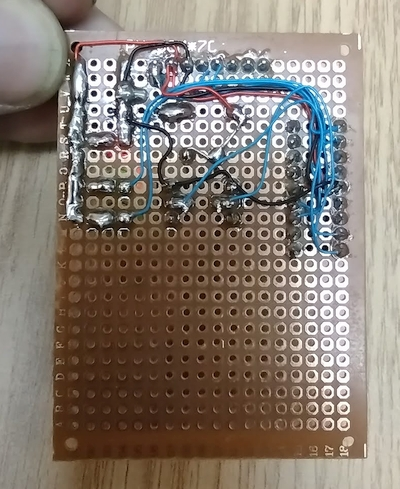
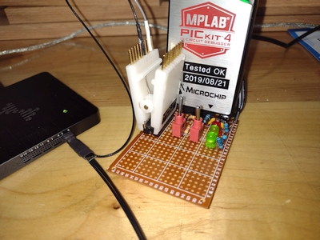

# BirdPool2022
Little "C" complete program to dump in a Microchip PIC18F1330 to control water valve for a bird bath.

Basically there is like a water fountain and birds like to take a bath there. 
Unfortunately, as they keep playing in the water, the water are throw outside and ultimately the bath is missing water. 
The little projet is to have an electric valve control by a little PIC18F1330 to control that valve to add water when necessary. 
There are two level switches for the water to help to determine when we are missing water and when we added enough.
More details to be added later.

# Timeline
2021-12-24 @ 22:35:00 - Begin the schematic and PCB drawings

---
2021-12-22 @ 22:07:00 - Prototype to test the initial program with a PIC18F1330 

